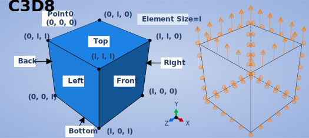

# One-Element INP Generator (Under Construction)
*Turbocharge Modeling with Abaqus Python Script*

## Introduction

In the realm of material characterization and constitutive modeling, the one-element model plays a pivotal role, offering a swift yet comprehensive exploration of stress-strain responses in the development of new constitutive processes. Despite its fundamental importance, working with one-element models can be monotonous and repetitive.

This repository, built with Python, aims to alleviate the tedium by providing a versatile tool for generating common one-element models. The repository supports various generation methods and types, allowing for efficient debugging and exploration of the impact of model parameters on mechanical descriptions.

If you have any questions, please contact **Yutai Su** at [buaa_syt@126.com](mailto:buaa_syt@126.com).

## File Structure

- **`README.md`**: Project documentation providing detailed information on the script and instructions for use.
- **`oeg_c3d8_aba.py`**: Abaqus Python script file responsible for generating C3D8 one-element inp and CAE.
- **`oeg_c3d8_inp.py`**: Python file running with **`c3d8.inp`** responsible for generating C3D8 one-element inp.
- **`c3d8.inp`**: C3D8 Inp template should be placed in the same directory with C3D8 Inp template **`oeg_c3d8_inp.py`**.
- **`examples/`**: Directory containing sample files demonstrating different configurations and use cases.

## Configuration Parameters

### Generation Methods
1. **Abaqus Python Script**
   - Generate CAE and INP files using an Abaqus Python script.
   - Run the script **`oeg_c3d8_aba.py`** by Abaqus to generate C3D8 one-element inp and CAE.
2. **Python IDE**
   - Directly generate INP files using a Python Integrated Development Environment.
   - Run the Python code **`oeg_c3d8_aba.py`** with the inp template **`c3d8.inp`** to generate the C3D8 one-element inp.

### Controllable Material Properties (Updating)
1. **Density**
2. **Elastic properties**
3. **User material properties**
4. **User defined field**
5. **User output variables**
6. **Conductivity**
7. **Specific heat**
8. **CTE(Expansion)**
9. **Depvar(State Dependent Variables, SDVs)**
10. **Plastic properties**

### Controllable Geometric Parameters
1. **Element Size**
   - Adjust the element size of the one-element model.

### Controllable Boundary Conditions
1. **Maximum Strain at final time**
   - Control the maximum strain at the final time step for precise simulations.

### Controllable Output Parameters
1. **Ineterval between Output Points**
   - Fine-tune the level of detail in the output results.

### Element Types (Updating)
1. **C3D8**



2. **CPE4**
3. **CPS4**
4. **...**

## Usage

1. **Install Abaqus**: Make sure Abaqus is installed on your system and that the environment variables are configured correctly.

2. **Clone the Repository**:

    ```bash
    git clone https://github.com/zhanqi-syt/one-element-inp-generator.git
    cd one-element-inp-generator
    ```

3. **Run the Script**:

    Modify the path and parameters in `oeg_c3d8_aba.py` as needed, then execute:

    ```bash
    abaqus cae noGUI=oeg_c3d8_aba.py
    ```

   **OR**
   
    Modify the path and parameters in `oeg_c3d8_inp.py` as needed, then run:

    ```bash
    python3 oeg_c3d8_inp.py
    ```

## Examples

Explore the `examples/` directory to see sample files showcasing how to configure the script for different types of single-element models. Each example includes corresponding documentation.

## Important Notes

- Before running the script, carefully read the `README.md` file to ensure all prerequisites are met.
- For any issues or suggestions, feel free to raise an issue on GitHub.

## License

This project is licensed under the [MIT License](LICENSE).

## Final Thoughts 🚀🚀🚀
  
The journey of exploring one element models is not just about simulations; it's a quest for understanding the intricacies of material behavior. As you navigate through this repository, may you find inspiration in the simplicity and power of one element models.

**Explore the diverse capabilities of this repository to streamline your one element model generation process.**

**Transform the mundane into the extraordinary with efficient, parameterized model generation.**

**Happy modeling!** 🚀🚀🚀
